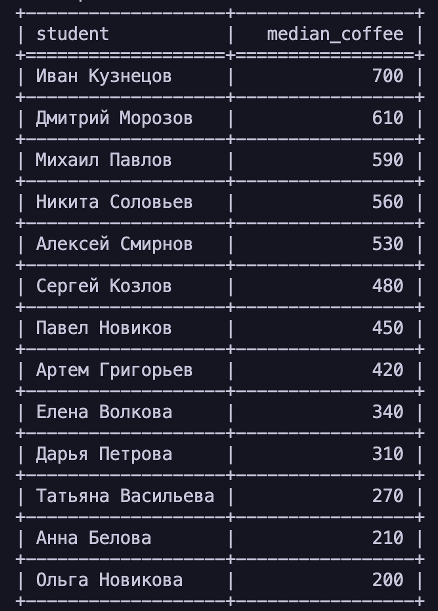

# CSV Report Tool

Скрипт для обработки CSV-файлов с данными студентов и генерации отчётов.

## Поддерживаемые отчёты

- `median-coffee` — медианная сумма трат на кофе по студентам

## Зависимости

- tabulate
- pytest

## Пример запуска

```bash
python main.py \
  --files data/math.csv data/physics.csv data/programming.csv \
  --report median-coffee
```

## Пример вывода

